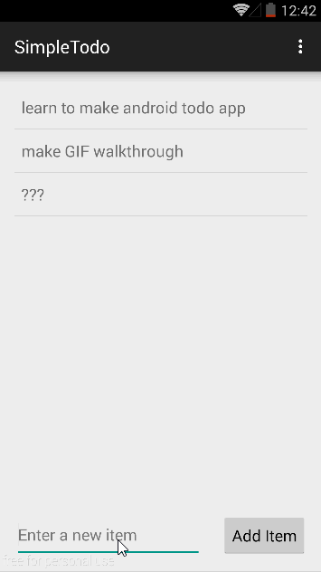

SimpleTodo
==========

Super Simple Todo Android app for Codepath course prework

Time Spent: Roughly 3 hours

#### Completed Tasks:

* [x] Setup Development Environment with Android Studio
* [x] Created app based on [tutorial] (https://docs.google.com/a/thecodepath.com/presentation/d/15JnmfmFa0hJOEkBhG_TeymChLzDzpOTJvBlOj29A9fY/edit) 
* [x] Updated app to have [edit task feature] (http://courses.codepath.com/snippets/intro_to_android/prework)

#### Notes:

- Used android studio 1.0 to create.
- Code is a bit more functional than the code in the tutorials. I try to avoid side effects in my code whereever possible without it becoming unwieldy. Much easier to follow

#### Gif Walkthrough

GIF created with [LiceCap](http://www.cockos.com/licecap/).
